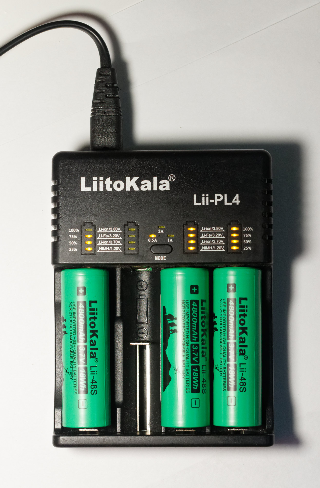
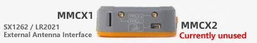
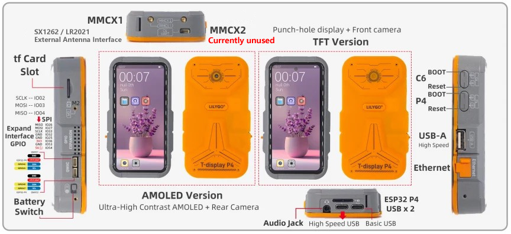

<h1 align="center">T-Display-P4</h1>

## **English** | [Chinese](./README_CN.md)

[](./LICENSE)
[](https://github.com/espressif/esp-idf)
[](https://isocpp.org/)

<p align="center">
  
</p>

## Overview

T-Display-P4 is a high-performance development platform built around the **ESP32-P4**. It combines a high-resolution MIPI-DSI touch display with an **ESP32-C6** wireless coprocessor and integrates audio, LoRa, GPS, Ethernet, motion sensing, battery monitoring, SD card storage, and MIPI-CSI camera support.

Two display assemblies are supported: a 4.05-inch 540 x 1168 TFT panel and a 4.1-inch 568 x 1232 AMOLED panel. The optional T-Display-P4-Keyboard expansion board adds a keyboard, backlight control, and T-MixRF radio/NFC interfaces.

## Directory

- [Overview](#overview)
- [Device Versions](#device-versions)
- [Notes](#notes)
- [Preview](#preview)
- [Supported Frameworks](#supported-frameworks)
- [Quick Start](#quick-start)
- [Hardware Modules](#hardware-modules)
- [Pin Overview](#pin-overview)
- [Project Materials](#project-materials)
- [FAQ](#faq)

## Device Versions

| Version | Date | Description |
| :---: | :---: | --- |
| T-Display-P4 V1.0 | 2025-06-13 | Initial device version |
| T-Display-P4-Keyboard V1.0 | 2025-09-12 | Initial keyboard expansion board |
| T-Display-P4 V2.0 Evaluation Preview | 2026-05-22 | Evaluation-preview hardware documentation |

## Notes

### Keyboard-Version Battery Safety and Usage

> [!WARNING]
> This notice applies to **T-Display-P4-Keyboard**. When the keyboard version is not in use, always slide the power switch on the keyboard to **OFF**. Leaving the switch on continues to consume battery power and may eventually discharge the 21700 cell into its low-voltage protection state.

If the battery enters low-voltage protection, it must first be removed and reactivated with a qualified external charger designed for rechargeable 21700 lithium-ion cells and capable of low-voltage recovery charging. Observe the correct polarity and follow the charger's instructions. After the battery has recovered, reinstall it in the keyboard; it can then continue to be charged and discharged normally through the T-Display-P4 host.

Do not bypass the battery protection circuit. If the external charger cannot recognize the cell, or if the cell is damaged, swollen, leaking, or unusually hot, stop using it and replace it safely.

<p align="center">
  
</p>

<p align="center"><em>Example showing 21700 cells in an external charger. Before use, confirm that the charger explicitly supports rechargeable 21700 lithium-ion cells and low-voltage recovery charging; the pictured brand is not required or endorsed. Photo: <a href="https://commons.wikimedia.org/wiki/File:21700_batteries_by_Liitokala_in_the_charger.jpg">Retired electrician / Wikimedia Commons</a>, CC0 1.0.</em></p>

### LoRa External Antenna Connectors

- `MMCX1` is the external antenna connector for the onboard `SX1262` or `LR2021` radio.
- `MMCX2` is not connected to any antenna or radio circuit and is currently unused. Do not use it as an antenna connector.

The `SKY13453` RF switch is controlled by `XL9535 IO1` (`VCTL`).

| `XL9535 IO1` / `VCTL` | Selected antenna path |
| :---: | --- |
| `1` | Internal antenna |
| `0` | External antenna through `MMCX1` |

> [!WARNING]
> Before selecting the external antenna path or transmitting, connect a suitable antenna to `MMCX1`. Transmitting without a suitable antenna connected may damage the RF circuit.

<p align="center">
  
</p>

## Preview

<p align="center">
  
</p>

<p align="center">
  
  
  
  
</p>

## Supported Frameworks

| Framework | Status | Version |
| --- | --- | --- |
| ESP-IDF | Recommended | `>= v5.5.4` |

## Quick Start

### Build With ESP-IDF

Install ESP-IDF first. For environment setup, refer to the official guide:
[ESP-IDF Get Started](https://docs.espressif.com/projects/esp-idf/en/latest/esp32p4/get-started/index.html)

Clone the repository together with its submodules:

```bash
git clone --recursive https://github.com/Xinyuan-LilyGO/T-Display-P4.git
```

If the repository was cloned without `--recursive`, initialize the submodules manually:

```bash
git submodule update --init --recursive
```

Select an example in `menuconfig`, then build and flash the project:

```bash
idf.py set-target esp32p4
idf.py menuconfig
idf.py build
idf.py flash monitor
```

```text
Example Configuration
`-- Select the example to build
```

### Examples

| Example Link | Description |
| --- | --- |
| [`lilygobox-espidf`](https://github.com/Xinyuan-LilyGO/lilygobox-espidf) | Factory application example for T-Display-P4 |
| [`lilygo_device_driver_example`](https://github.com/Xinyuan-LilyGO/lilygo_device_driver_example) | Shared examples maintained in a dedicated application project |
| [`main/examples`](./main/examples) | Examples specific to the T-Display-P4 board |
| [`main/keyboard_examples`](./main/keyboard_examples) | Examples for the keyboard expansion board |

Open an example link above for the current source and supported example list.

### Prebuilt Firmware

The following firmware is prebuilt.

To flash prebuilt firmware, refer to Espressif's official [ESP firmware online flashing platform guide](https://docs.espressif.com/projects/esp-techpedia/en/latest/esp-friends/get-started/try-firmware/try-firmware-platform.html).

| Firmware | Flash Address | Description |
| --- | --- | --- |
| [`LilygoBox`](https://github.com/Xinyuan-LilyGO/lilygobox-espidf/releases/latest) | `0x0 (merged)` | Latest factory firmware for T-Display-P4 |
| [`[T-Display-P4][coprocessor_download_mode]`](<./firmware/[T-Display-P4][coprocessor_download_mode]>) | `0x0` | Main-device preparation firmware for coprocessor download mode |
| [`[T-Display-P4][edge_agent]`](<./firmware/[T-Display-P4][edge_agent]>) | `0x0` | Edge Agent application firmware |
| [`[T-Display-P4][xiaozhi]`](<./firmware/[T-Display-P4][xiaozhi]>) | `0x0` | Xiaozhi application firmware |

> [!IMPORTANT]
> Select `ESP32-P4` when flashing T-Display-P4 main-device firmware. When flashing the coprocessor network-adapter firmware, select the actual coprocessor fitted to the board; select `ESP32-C6` for T-Display-P4 V1.0. Firmware images are not interchangeable between chips.

#### Flashing the Coprocessor Network-Adapter Firmware

To keep these instructions compatible with future hardware revisions that may
use a different coprocessor, this section uses the generic term
"coprocessor." T-Display-P4 V1.0 uses an ESP32-C6 coprocessor.

Before flashing the coprocessor, first flash and run the coprocessor
download-mode preparation program on the T-Display-P4 main device:

1. Preparation program source: [`coprocessor_download_mode`](https://github.com/Xinyuan-LilyGO/lilygo_device_driver_example/tree/main/main/examples/coprocessor_download_mode).
2. Alternatively, use the prebuilt firmware in [`firmware/[T-Display-P4][coprocessor_download_mode]`](<./firmware/[T-Display-P4][coprocessor_download_mode]>).
3. Flash the preparation program to the T-Display-P4 main device, start the main device normally, and monitor its serial output.

> [!IMPORTANT]
> Continue only after the main device is running normally and its serial log prints `Coprocessor preparation completed`. Do not attempt to flash the coprocessor until this message appears.

The coprocessor must be flashed through its dedicated UART connector on the
device. The connector location and pin order are shown below:

<p align="center">
  
</p>

Use a USB-to-UART adapter with **3.3 V logic levels** and cross-connect the
receive and transmit signals:

| T-Display-P4 coprocessor connector | USB-to-UART adapter |
| --- | --- |
| `RX` | `TX` |
| `TX` | `RX` |
| `GND` | `GND` |
| `3.3V` | Connect to `3.3V` only when the adapter requires a logic-level reference |

> [!WARNING]
> Never connect 5 V UART logic or a 5 V supply to the `3.3V` pin. Power the T-Display-P4 normally and connect only `RX`, `TX`, and `GND` to the USB-to-UART adapter whenever possible. Connect `3.3V` only after confirming that the adapter requires an external logic-level reference.

##### Checking the Connection with Flash Download Tool

Before flashing, follow Espressif's official [`chipInfoDump` instructions](https://docs.espressif.com/projects/esp-test-tools/en/latest/esp32c6/production_stage/tools/flash_download_tool.html#chipinfodump-tab) and use `Chip Info` to confirm non-destructively that the coprocessor is in download mode and that the COM port and bidirectional `TX/RX` communication are working. If the chip and Flash information cannot be read, do not erase or flash; first check download mode, UART wiring, and serial-port usage.

Flashing procedure:

1. Download the network-adapter firmware matching the fitted coprocessor from the latest [`LilygoBox` release](https://github.com/Xinyuan-LilyGO/lilygobox-espidf/releases/latest).
2. Power off the device and connect the USB-to-UART adapter as shown above.
3. Power the T-Display-P4 normally and confirm again that the main device is running and has printed `Coprocessor preparation completed`.
4. **Put the coprocessor into download mode:** hold the coprocessor `BOOT` button, press and release its `RESET` button once, and then release the `BOOT` button.
5. Open Espressif's ESP firmware online flashing platform or Flash Download Tool and select the actual coprocessor fitted to the board (`ESP32-C6` for T-Display-P4 V1.0), then select the serial port belonging to the USB-to-UART adapter.
6. Select the network-adapter `.bin` file, set the flash address to `0x0`, and start flashing.
7. When flashing finishes, reflash the required application firmware to the T-Display-P4 main device and power-cycle the complete device.

If the flashing tool cannot connect, first verify that the preparation program
has printed `Coprocessor preparation completed`. Then repeat step 4 and check
that `RX/TX` are cross-connected, the adapter uses 3.3 V logic, and no other
program has opened the serial port.

## Hardware Modules

### T-Display-P4 V1.0

| Function | Device | Interface |
| --- | --- | --- |
| Main MCU | ESP32-P4, 16 MB flash | — |
| Wireless coprocessor | ESP32-C6-MINI-1U / ESP32-C6-FH4, 4 MB flash | SDIO |
| TFT display and touch | H0405S002T002-V0 / HI8561, 4.05 inch, 540 x 1168 | MIPI-DSI / I2C |
| AMOLED display and touch | H0410S001AMT001-V0 / RM69A10 / GT9895, 4.1 inch, 568 x 1232 | MIPI-DSI / I2C |
| Audio | ES8311 / NS4150B / electret condenser microphone | I2S |
| LoRa | SX1262 / LR2021 | SPI |
| GPS | L76K | UART |
| RTC | PCF8563 | I2C |
| IMU | ICM20948 | I2C |
| Vibration | AW86224AFCR | I2C |
| Charging | LGS4056H with battery NTC support | — |
| Battery gauge | BQ27220 | I2C |
| Camera | OV2710 | MIPI-CSI |
| SD card | SD card slot | SDMMC / SPI |
| Ethernet | IP101GRI | RMII |
| IO expansion | XL9535 | I2C |

- Related documents:
  - [Espressif technical documents](https://www.espressif.com/en/support/documents/technical-documents)
  - [ESP32-C6-MINI-1/MINI-1U datasheet](https://www.espressif.com/sites/default/files/documentation/esp32-c6-mini-1_mini-1u_datasheet_en.pdf)
  - [HI8561](<./docs/HI8561_Preliminary _DS_V0.00_20230511.pdf>)
  - [RM69A10](<./docs/RM69A10_DataSheet_V0.2_20230330%C2%A0(Public%C2%A0version).pdf>)
  - [GT9895](./docs/GT9895_Datasheet_V1.1.pdf)
  - [ES8311](./docs/ES8311.pdf)
  - [NS4150B](./docs/NS4150B.pdf)
  - [SX1262](./docs/DS_SX1261-2_V2_1.pdf)
  - [LR2021](<./参考资料/semtech_cpp_bus_driver/LR2021_22_12_Datasheet_v2.1.pdf>)
  - [L76K](./docs/L76KB-A58.pdf)
  - [PCF8563](./docs/PCF8563.pdf)
  - [ICM20948](./docs/ICM20948.pdf)
  - [AW86224AFCR](./docs/AW86224AFCR.pdf)
  - [LGS4056H](./docs/LGS4056H.pdf)
  - [BQ27220](./docs/bq27220_en.pdf)
  - [OV2710](<./docs/OV2710_CSP3_DS_2.0_KING HORN ENTERPRISES Ltd..pdf>)
  - [IP101GRI](./docs/IP101GRI.pdf)
  - [XL9535](./docs/XL95x5.pdf)

### T-Display-P4-Keyboard V1.0

| Function | Device | Interface |
| --- | --- | --- |
| Keyboard controller | TCA8418 | I2C |
| Keyboard backlight | SY7200A | PWM |
| IO expansion | XL9555 | I2C |
| Sub-GHz radio | CC1101 on T-MixRF | SPI |
| 2.4 GHz radio | NRF24L01 on T-MixRF | SPI |
| NFC | ST25R3916 on T-MixRF | SPI |

- Related documents:
  - [TCA8418](./docs/tca8418.pdf)
  - [SY7200A](./docs/SY7200AABC.pdf)
  - [XL9555](./docs/XL95x5.pdf)
  - [CC1101](./docs/cc1101.pdf)
  - [NRF24L01](./docs/NRF24L01P-R.pdf)
  - [ST25R3916](./docs/st25r3916.pdf)

## Pin Overview

Board pin definitions are provided in the device-driver configuration files:

- [`t_display_p4_config.h`](./libraries/lilygo_device_driver/src/device/t_display_p4/t_display_p4_config.h)
- [`t_display_p4_keyboard_config.h`](./libraries/lilygo_device_driver/src/device/t_display_p4/t_display_p4_keyboard_config.h)

## Project Materials

| Document | Description |
| --- | --- |
| [`T-Display-P4 V1.0 TFT`](<./project/T-Display-P4_V1.0(H0405S002T002-V0)_202601061148.pdf>) | V1.0 hardware project PDF for the 4.05-inch TFT assembly |
| [`T-Display-P4 V1.0 AMOLED`](<./project/T-Display-P4_V1.0(H0410S001AMT001-V0)_202601061148.pdf>) | V1.0 hardware project PDF for the 4.1-inch AMOLED assembly |
| [`T-Display-P4 V2.0 Evaluation Preview`](<./project/T-Display-P4_v2.0(Evaluation Preview)_202605221021.pdf>) | V2.0 evaluation-preview hardware project PDF |
| [`docs`](./docs) | Datasheets and peripheral documentation |
| [`Power Consumption Test Log`](<./relevant_test/PowerConsumptionTestLog_[T-Display-P4_V1.0]_20250605.pdf>) | T-Display-P4 V1.0 power-consumption measurements |

## FAQ

<details>
<summary>Q. Why does the board continuously fail to flash?</summary>

A. Hold down the `BOOT` button while starting the download, then release it after flashing begins.

</details>

<details>
<summary>Q. Why does the ESP32-P4 remain locked in download mode after restarting?</summary>

A. If the ESP32-P4 unexpectedly resets while running, or if the device enters deep sleep, it may continue to enter download mode on the next startup. Use the following procedure to clear this state:

1. Disconnect USB and all other external power sources.
2. Turn off the onboard battery power switch.
3. Press the ESP32-P4 `RST` button to help discharge any residual power on the board, then wait and confirm that the device is fully powered off.
4. Turn the battery switch back on or reconnect external power, then start the device.

After a complete power discharge, the ESP32-P4 should boot normally instead of continuing to enter download mode.

</details>

<details>
<summary>Q. Why are submodule headers or components missing?</summary>

A. Initialize all repository submodules:

```bash
git submodule update --init --recursive
```

</details>

<details>
<summary>Q. How do I select a different example?</summary>

A. Run `idf.py menuconfig`, open `Example Configuration`, select the desired example, save, and rebuild the project.

</details>
