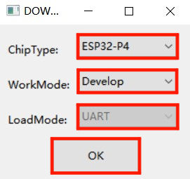
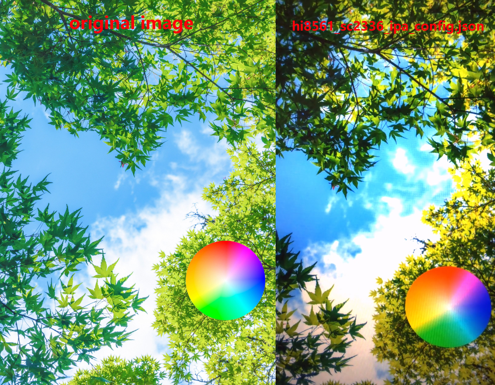

<!--
 * @Description: None
 * @Author: LILYGO_L
 * @Date: 2025-06-13 15:12:02
 * @LastEditTime: 2025-06-18 11:05:10
 * @License: GPL 3.0
-->
<h1 align = "center">T-Display-P4</h1>

## **English | [中文](./README_CN.md)**

## VersionIteration:
| Version                               | Update date                       |Update description|
| :-------------------------------: | :-------------------------------: |:--------------: |
| T-Display-P4_V1.0                      | 2025-06-13                    |   Original version      |

## PurchaseLink

| Product                     | SOC           |  FLASH  |  PSRAM   | Link                   |
| :------------------------: | :-----------: |:-------: | :---------: | :------------------: |
| T-Display-P4_V1.0   | NULL |   NULL   | NULL |  [NULL]()   |

## Directory
- [Describe](#describe)
- [Preview](#preview)
- [Module](#module)
- [SoftwareDeployment](#SoftwareDeployment)
- [PinOverview](#pinoverview)
- [RelatedTests](#RelatedTests)
- [FAQ](#faq)
- [Project](#project)

## Describe

The T-Display-P4 is a versatile development board based on the ESP32-P4 core. Its features include:  

1. **High Processing Power**: Equipped with the high-performance ESP32-P4 core processor, it can handle more complex graphics and video tasks, delivering smoother display performance.  
2. **Low Power Design**: Offers multiple selectable power modes to effectively reduce energy consumption and extend battery life.  
3. **High-Resolution Display**: Supports high resolution (default with a large MIPI interface screen at 540x1168px), providing sharp and clear visuals.  
4. **Rich Peripheral Support**: Onboard peripherals include an HD MIPI touchscreen, ESP32-C6 module, speaker, microphone, LoRa module, GPS module, Ethernet, a linear vibration motor, an independent battery gauge for monitoring battery health and percentage, and an MIPI camera. Multiple GPIOs of both the ESP32-P4 and ESP32-C6 are exposed, enhancing the device's expandability.  

## Preview
#### Beta version test images

    

---

    

### Actual Product Image

## Module

### 1. Core Processor  

* Chip: ESP32-P4  
* FLASH: 32M  
* Related Documents:  
    >[Espressif](https://www.espressif.com/en/support/documents/technical-documents)  

### 2. Display & Touch  

> #### Model: H0405S002T002-V0  
> * Display Size (Diagonal): 4.05 inch  
> * LCD Type: α-Si TFT  
> * Resolution: 540(H) × 1168(V) px  
> * Active Area: 41.9904(W) × 91.1040(H) mm  
> * Module Dimensions: 44(H) × 95.5(V) × 1.46(T) mm  
> * Display Colors: 16.7M  
> * Display Interface: MIPI  
> * Touch Interface: IIC
> * Display & Touch Driver IC: HI8561  
> * Maximum touch points: 10-point touch
> * Luminance on surface: 550 cd/mm
> * View Direction: All
> * Contrast ratio: 1200:1
> * Color gamut: 70%
> * PPI: 326
> * Window effect: No all-black  
> * Cover plate surface effect: No AF/AG
> * Operating Temperature: -20～70  ºC
> * Storage Temperature: -30～80 ºC
> * Related Documents:  
>    >[HI8561](./information/HI8561_Preliminary%20_DS_V0.00_20230511.pdf)  

* Dependent Libraries:  
    >[cpp_bus_driver](https://github.com/Llgok/cpp_bus_driver)  

### 3. Speaker & Microphone  

* DAC Chip: ES8311  
* Amplifier Chip: NS4150B  
* Microphone: Electret Condenser Mic  
* Communication Protocol: IIS
* Related Documents:  
    >[ES8311](./information/ES8311.pdf)  
    >[NS4150B](./information/NS4150B.pdf)  
* Dependent Libraries:  
    >[cpp_bus_driver](https://github.com/Llgok/cpp_bus_driver)  

### 4. Vibration  

* Driver IC: AW86224AFCR  
* Communication Protocol: IIC
* Related Documents:  
    >[AW86224](./information/AW86224AFCR.pdf)  
* Dependent Libraries:  
    >[cpp_bus_driver](https://github.com/Llgok/cpp_bus_driver)  

### 5. LoRa  

* Module: HPD16A  
* Chip: SX1262  
* Communication Protocol: Standard SPI  
* Related Documents:  
    >[HPD16A](./information/HPDTEK_HPD16A_TCXO_V1.1.pdf)  
    >[SX1261-2](./information/DS_SX1261-2_V2_1.pdf)  
* Dependent Libraries:  
    >[cpp_bus_driver](https://github.com/Llgok/cpp_bus_driver)  

### 6. GPS  

* Module: L76K  
* Communication Protocol: Uart
* Related Documents:  
    >[L76K](./information/L76KB-A58.pdf)  
* Dependent Libraries:  
    >[cpp_bus_driver](https://github.com/Llgok/cpp_bus_driver)  

### 7. RTC  

* Chip: PCF8563  
* Communication Protocol: IIC
* Related Documents:  
    >[PCF8563](./information/PCF8563.pdf)  
* Dependent Libraries:  
    >[cpp_bus_driver](https://github.com/Llgok/cpp_bus_driver)  

### 8. Charging IC  

* Chip: LGS4056H  
* Additional Notes: The NTC pin of the 3-wire battery is connected to the LGS4056H charging IC. Over-temperature protection during charging is automatically controlled by the chip.  
* Related Documents:  
    >[LGS4056H](./information/LGS4056H.pdf)  

### 9. Battery Gauge  

* Chip: BQ27220  
* Communication Protocol: IIC
* Related Documents:  
    >[BQ27220](./information/bq27220_en.pdf)  
* Dependent Libraries:  
    >[cpp_bus_driver](https://github.com/Llgok/cpp_bus_driver)  

### 10. Camera  

> #### Model: OV2710  
> * Interface: MIPI  
> * Related Documents:  
>    >[OV2710](./information/OV2710_CSP3_DS_2.0_KING%20HORN%20ENTERPRISES%20Ltd..pdf)  

### 11. IMU

* Chip: ICM20948
* Communication Protocol: IIC
* Related Documents:  
    >[ICM20948](./information/ICM20948.pdf)
* Dependent Libraries:  
    >[cpp_bus_driver](https://github.com/Llgok/cpp_bus_driver)  
    >[ICM20948_WE](https://github.com/Llgok/ICM20948_WE)

## SoftwareDeployment

### Examples Support

| example | `[vscode][esp-idf-v5.4.0]` | Description | Picture |
| ------  | ------ | ------ | ------ | 
| [aw86224](./main/examples/aw86224) |  
![alt text][supported] | | |
| [bq27220](./main/examples/bq27220) |  
![alt text][supported] | | |
| [deep_sleep](./main/examples/deep_sleep) |  
![alt text][supported] | | |
| [es8311](./main/examples/es8311) |  
![alt text][supported] | | |
| [es8311_sd_wav](./main/examples/es8311_sd_wav) |  
![alt text][supported] | | |
| [esp32c6_at_host_sdio_uart](./main/examples/esp32c6_at_host_sdio_uart) |  
![alt text][supported] | | |
| [esp32c6_at_host_sdio_wifi](./main/examples/esp32c6_at_host_sdio_wifi) |  
![alt text][supported] | | |
| [hi8561_camera](./main/examples/hi8561_camera) |  
![alt text][supported] | | |
| [hi8561_lvgl](./main/examples/hi8561_lvgl) |  
![alt text][supported] | | |
| [hi8561_lvgl_touch_draw](./main/examples/hi8561_lvgl_touch_draw) |  
![alt text][supported] | | |
| [icm20948](./main/examples/icm20948) |  
![alt text][supported] | | |
| [iic_scan](./main/examples/iic_scan) |  
![alt text][supported] | | |
| [l76k](./main/examples/l76k) |  
![alt text][supported] | | |
| [lvgl_9_ui](./main/examples/lvgl_9_ui) |  
![alt text][supported] |factory example | |
| [pcf8563](./main/examples/pcf8563) |  
![alt text][supported] | | |
| [sgm38121](./main/examples/sgm38121) |  
![alt text][supported] | | |
| [sx1262_gfsk_send_receive](./main/examples/sx1262_gfsk_send_receive) |  
![alt text][supported] | | |
| [sx1262_lora_send_receive](./main/examples/sx1262_lora_send_receive) |  
![alt text][supported] | | |
| [sx1262_tx_continuous_wave](./main/examples/sx1262_tx_continuous_wave) |  
![alt text][supported] | | |
| [tusb_serial_device](./main/examples/tusb_serial_device) |  
![alt text][supported] | | |
| [xl9535](./main/examples/Vibration_Motor) |  
![alt text][supported] | | |

[supported]: https://img.shields.io/badge/-supported-green "example"

| firmware | description | picture |
| ------  | ------  | ------ |
| [lvgl_9_ui(ov2710)](./firmware/[T-Display-P4][lvgl_9_ui][ov2710]_firmware_202505301532.bin) | OV2710 camera version factory program |  |

### ESP-IDF Visual Studio Code  
1. Install [Visual Studio Code](https://code.visualstudio.com/Download) by selecting the appropriate version for your operating system.  

2. Open the "Extensions" sidebar in Visual Studio Code (or use <kbd>Ctrl</kbd>+<kbd>Shift</kbd>+<kbd>X</kbd> to open extensions), search for the "ESP-IDF" extension, and install it.  

3. While the extension is installing, use the git command to clone the repository:  

        git clone --recursive https://github.com/Xinyuan-LilyGO/T-Display-P4.git  

    Ensure you include the `--recursive` flag during cloning. If you forget to include it, you will need to initialize the submodules later by running:  

        git submodule update --init --recursive  

4. Download and install [ESP-IDF v5.4.1](https://dl.espressif.cn/dl/esp-idf/?idf=4.4). Take note of the installation path. Open the previously installed "ESP-IDF" extension and select "Configure ESP-IDF Extension." Choose the "USE EXISTING SETUP" menu, then select "Search ESP-IDF in system." Correctly configure the installation path you noted earlier:  
   - **Enter ESP-IDF directory (IDF_PATH):** `Your installation path xxx\Espressif\frameworks\esp-idf-v5.4`  
   - **Enter ESP-IDF Tools directory (IDF_TOOLS_PATH):** `Your installation path xxx\Espressif`  
    Click the "Install" button at the bottom right to proceed with the framework installation.  

5. Click the "SDK Configuration Editor" in the ESP-IDF extension menu at the bottom of Visual Studio Code. In the search bar, look for the field "Select the example to build" and choose the project you want to compile. Then, search for "Select the camera type" and select the camera model integrated on your board. Save the settings.  

6. Click "Set Espressif Device Target" in the bottom menu bar of Visual Studio Code and select **ESP32P4**. Next, click "Build Project" in the bottom menu bar and wait for the build to complete. Then, click "Select Port to Use," followed by "Flash Project" to upload the program.  

    

### firmware download
1. Open the project file "tools" and locate the ESP32 burning tool. Open it.

2. Select the correct burning chip and burning method, then click "OK." As shown in the picture, follow steps 1->2->3->4->5 to burn the program. If the burning is not successful, press and hold the "BOOT-0" button and then download and burn again.

3. Burn the file in the root directory of the project file "[firmware](./firmware/)" file,There is a description of the firmware file version inside, just choose the appropriate version to download.

    
    

## PinOverview

For pin definitions, please refer to the pin configuration file: [pin_config.h](./components/private_library/pin_config.h)

## RelatedTests

### Power Consumption
| firmware | program | description | picture |
| ------  | ------  | ------ | ------ | 
| [deep_sleep(single_board)](./firmware/sleep/[T-Display-P4][deep_sleep][single_board]_firmware_202505301450.bin) |[deep_sleep](./main/examples/deep_sleep/)| Average current consumption: 1.2mA. For more details, please refer to the [Power Consumption Test Log](./relevant_test/PowerConsumptionTestLog_[T-Display-P4_V1.0]_20250605.pdf).| |

### Camera
| program | description | picture |
| ------  | ------ | ------ | 
| [uvc_sc2336](./debug/examples/uvc_sc2336/)| Original image and screenshot effect of taking a picture on the screen. | 
  
 |
| [uvc_ov2710](./debug/examples/uvc_ov2710/)| Original image and screenshot effect of taking a picture on the screen. | 
  
 |

## FAQ

* Q. After reading the above tutorials, I still don't know how to build a programming environment. What should I do?
* A. If you still don't understand how to build an environment after reading the above tutorials, you can refer to the [LilyGo-Document](https://github.com/Xinyuan-LilyGO/LilyGo-Document) document instructions to build it.

 

* Q. Why is my board continuously failing to download the program?
* A. Please hold down the "BOOT-0" button and try downloading the program again.

## Project
* 

