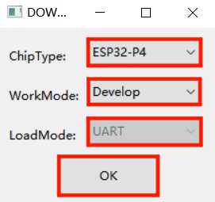
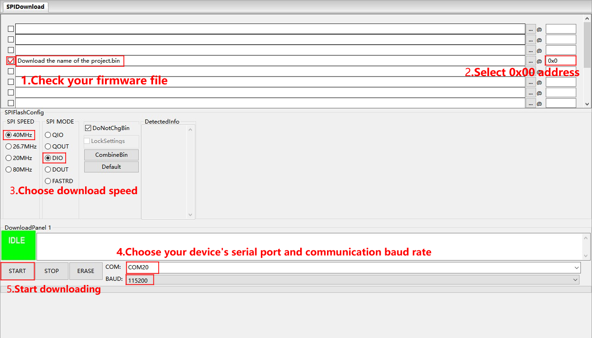
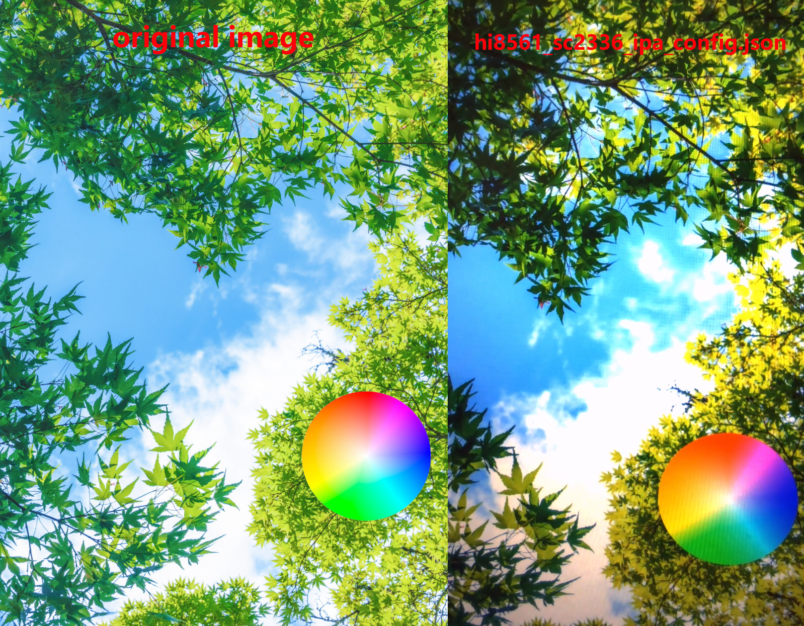

<!--
 * @Description: None
 * @Author: LILYGO_L
 * @Date: 2025-06-13 15:12:02
 * @LastEditTime: 2025-06-13 17:57:37
 * @License: GPL 3.0
-->
<h1 align = "center">T-Display-P4</h1>

## **[English](./README.md) | 中文**

## 版本迭代:
| Version                               | Update date                       |Update description|
| :-------------------------------: | :-------------------------------: |:--------------: |
| T-Display-P4_V1.0                      | 2025-06-13                    |   初始版本      |

## 购买链接

| Product                     | SOC           |  FLASH  |  PSRAM   | Link                   |
| :------------------------: | :-----------: |:-------: | :---------: | :------------------: |
| T-Display-P4_V1.0   | NULL |   NULL   | NULL |  [NULL]()   |

## 目录
- [描述](#描述)
- [预览](#预览)
- [模块](#模块)
- [软件部署](#软件部署)
- [引脚总览](#引脚总览)
- [相关测试](#相关测试)
- [常见问题](#常见问题)
- [项目](#项目)

## 描述

T-Display-P4是基于ESP32-P4核心开发的多功能板，该产品的特点包括：

1.  **高处理能力**：搭载高性能核心处理器ESP32-P4，能够处理更复杂的图形和视频任务，提供更流畅的显示效果。
2.  **低功耗设计**：具有多种可选的工作模式，能够有效降低功耗，延长电池寿命。
3.  **高分辨率显示**：具有较高的分辨率（默认搭配MIPI接口大屏，分辨率为540x1168px），提供清晰的显示效果。
4.  **丰富的外设支持**：板载高清MIPI触摸屏、ESP32-C6模块、扬声器、麦克风、Lora模块、Gps模块、以太网、线性振动马达、独立的电池电量监测计可监测电池健康度和电量百分比、MIPI摄像头等，引出了ESP32-P4和ESP32-C6的多个IO口，提高了设备的可扩展性。

## 预览

### 实物图

## 模块

### 1. 核心处理器

* 芯片：ESP32-P4
* FLASH：32M
* 相关资料：
    >[Espressif](https://www.espressif.com/en/support/documents/technical-documents)

### 2. 屏幕和触摸

> #### 型号：H0405S002T002-V0
> * 显示尺寸(对角线)：4.05 inch
> * 液晶显示屏类型：α-Si TFT
> * 分辨率：540(H)x1168(V) px
> * 显示区：41.9904(W)x91.1040(H) mm
> * 模组外形：44(H) ×95.5(V)×1.46(T) mm
> * 显示颜色：16.7M
> * 屏幕通讯接口：MIPI
> * 触摸通讯接口：IIC
> * 屏幕和触摸驱动芯片：HI8561
> * 相关资料：
>    >[HI8561](./information/HI8561_Preliminary%20_DS_V0.00_20230511.pdf)

* 依赖库：
    >[cpp_bus_driver-v1.0.0](https://github.com/Llgok/cpp_bus_driver)

### 3. 扬声器和麦克风

* DAC芯片：ES8311
* 功放芯片：NS4150B
* 麦克风芯片：mic咪头
* 通信协议：IIS
* 相关资料：
    >[ES8311](./information/ES8311.pdf)
    >[NS4150B](./information/NS4150B.pdf)
* 依赖库：
    >[cpp_bus_driver-v1.0.0](https://github.com/Llgok/cpp_bus_driver)

### 4. 振动

* 驱动芯片：AW86224AFCR
* 通信协议：IIC
* 相关资料：
    >[AW86224](./information/AW86224AFCR.pdf)
* 依赖库：
    >[cpp_bus_driver-v1.0.0](https://github.com/Llgok/cpp_bus_driver)

### 5. Lora

* 模块：HPD16A
* 芯片：SX1262
* 通信协议：标准SPI
* 相关资料：
    >[HPD16A](./information/HPDTEK_HPD16A_TCXO_V1.1.pdf)    
    >[SX1261-2](./information/DS_SX1261-2_V2_1.pdf)
* 依赖库：
    >[cpp_bus_driver-v1.0.0](https://github.com/Llgok/cpp_bus_driver)

### 6. Gps

* 模块：L76k
* 通信协议：Uart
* 相关资料：
    >[L76K](./information/L76KB-A58.pdf)
* 依赖库：
    >[cpp_bus_driver-v1.0.0](https://github.com/Llgok/cpp_bus_driver)

### 7. Rtc

* 芯片：PCF8563
* 通信协议：IIC
* 相关资料：
    >[PCF8563](./information/PCF8563.pdf)
* 依赖库：
    >[cpp_bus_driver-v1.0.0](https://github.com/Llgok/cpp_bus_driver)

### 8. 充电芯片

* 芯片：LGS4056H
* 其他说明：三线电池NTC引脚连接在充电芯片LGS4056H上，充电过温保护由芯片自动控制
* 相关资料：
   >[LGS4056H](./information/LGS4056H.pdf)

### 9. 电量监测计

* 芯片：BQ27220
* 通信协议：IIC
* 相关资料：
    >[BQ27220](./information/bq27220_en.pdf)
* 依赖库：
    >[cpp_bus_driver-v1.0.0](https://github.com/Llgok/cpp_bus_driver)

### 10. 摄像头

> #### 型号：OV2710
> * 通讯接口：MIPI
> * 相关资料：
>    >[OV2710](./information/OV2710_CSP3_DS_2.0_KING%20HORN%20ENTERPRISES%20Ltd..pdf)

## 软件部署

### 示例支持

| example | `[vscode][esp-idf-v5.4.0]` | Description | Picture |
| ------  | ------ | ------ | ------ | 
| [aw86224](./main/examples/aw86224) |  
![alt text][supported] | | |
| [bq27220](./main/examples/bq27220) |  
![alt text][supported] | | |
| [deep_sleep](./main/examples/deep_sleep) |  
![alt text][supported] | | |
| [es8311](./main/examples/es8311) |  
![alt text][supported] | | |
| [es8311_sd_wav](./main/examples/es8311_sd_wav) |  
![alt text][supported] | | |
| [esp32c6_at_host_sdio_uart](./main/examples/esp32c6_at_host_sdio_uart) |  
![alt text][supported] | | |
| [esp32c6_at_host_sdio_wifi](./main/examples/esp32c6_at_host_sdio_wifi) |  
![alt text][supported] | | |
| [hi8561_camera](./main/examples/hi8561_camera) |  
![alt text][supported] | | |
| [hi8561_lvgl](./main/examples/hi8561_lvgl) |  
![alt text][supported] | | |
| [hi8561_lvgl_touch_draw](./main/examples/hi8561_lvgl_touch_draw) |  
![alt text][supported] | | |
| [icm20948](./main/examples/icm20948) |  
![alt text][supported] | | |
| [iic_scan](./main/examples/iic_scan) |  
![alt text][supported] | | |
| [l76k](./main/examples/l76k) |  
![alt text][supported] | | |
| [lvgl_9_ui](./main/examples/lvgl_9_ui) |  
![alt text][supported] |出厂示例 | |
| [pcf8563](./main/examples/pcf8563) |  
![alt text][supported] | | |
| [sgm38121](./main/examples/sgm38121) |  
![alt text][supported] | | |
| [sx1262_gfsk_send_receive](./main/examples/sx1262_gfsk_send_receive) |  
![alt text][supported] | | |
| [sx1262_lora_send_receive](./main/examples/sx1262_lora_send_receive) |  
![alt text][supported] | | |
| [sx1262_tx_continuous_wave](./main/examples/sx1262_tx_continuous_wave) |  
![alt text][supported] | | |
| [tusb_serial_device](./main/examples/tusb_serial_device) |  
![alt text][supported] | | |
| [xl9535](./main/examples/Vibration_Motor) |  
![alt text][supported] | | |

[supported]: https://img.shields.io/badge/-supported-green "example"

| firmware | description | picture |
| ------  | ------  | ------ |
| [lvgl_9_ui(ov2710)](./firmware/[T-Display-P4][lvgl_9_ui][ov2710]_firmware_202505301532.bin) | OV2710摄像头版本出厂程序 |  |

### ESP-IDF Visual Studio Code
1. 安装 [Visual Studio Code](https://code.visualstudio.com/Download) ，根据你的系统类型选择安装。

2. 打开 VisualStudioCode 软件侧边栏的“扩展”（或者使用<kbd>Ctrl</kbd>+<kbd>Shift</kbd>+<kbd>X</kbd>打开扩展），搜索“ESP-IDF”扩展并下载。

3. 在安装扩展的期间，使用git命令克隆仓库

        git clone --recursive https://github.com/Xinyuan-LilyGO/T-Display-P4.git

    克隆时候需要同时加上“--recursive”，如果克隆时候未加上那么之后使用的时候需要初始化一下子模块

        git submodule update --init --recursive

4. 下载安装 [ESP-IDF v5.4.1](https://dl.espressif.cn/dl/esp-idf/?idf=4.4)，记录一下安装路径，打开之前安装好的“ESP-IDF”扩展打开“配置 ESP-IDF 扩展”，选择“USE EXISTING SETUP”菜单，选择“Search ESP-IDF in system”栏，正确配置之前记录的安装路径，“Enter ESP-IDF directory (IDF_PATH): 你的安装路径xxx\Espressif\frameworks\esp-idf-v5.4”和“Enter ESP-IDF Tools directory (IDF_TOOLS_PATH): 你的安装路径xxx\Espressif”，点击右下角的“install”进行框架安装。

5. 点击 Visual Studio Code 底部菜单栏的 ESP-IDF 扩展菜单“SDK 配置编辑器”，在搜索栏里搜索“Select the example to build”字段，选择你所需要编译的项目，再在搜索栏里搜索“Select the camera type”字段，选择你的板子板载的摄像头类型，点击保存。

6. 点击 Visual Studio Code 底部菜单栏的“设置乐鑫设备目标”，选择ESP32P4，点击底部菜单栏的“构建项目”，等待构建完成后点击底部菜单栏的“选择要使用的端口”，之后点击底部菜单栏的“烧录项目”进行烧录程序。

    

### firmware烧录
1. 打开项目文件“tools”找到ESP32烧录工具，打开。

2. 选择正确的烧录芯片以及烧录方式点击“OK”，如图所示根据步骤1->2->3->4->5即可烧录程序，如果烧录不成功，请按住“BOOT-0”键再下载烧录。

3. 烧录文件在项目文件根目录“[firmware](./firmware/)”文件下，里面有对firmware文件版本的说明，选择合适的版本下载即可。

    
    

## 引脚总览

引脚定义请参考引脚配置文件：[pin_config.h](./components/private_library/pin_config.h)

## 相关测试

### 功耗
| firmware | program | description | picture |
| ------  | ------  | ------ | ------ | 
| [deep_sleep(single_board)](./firmware/sleep/[T-Display-P4][deep_sleep][single_board]_firmware_202505301450.bin) |[deep_sleep](./main/examples/deep_sleep/)| 平均电流消耗: 1.2mA 更多信息请查看 [功耗测试日志](./relevant_test/PowerConsumptionTestLog_[T-Display-P4_V1.0]_20250605.pdf) | |

### 摄像头
| program | description | picture |
| ------  | ------ | ------ | 
| [uvc_sc2336](./debug/examples/uvc_sc2336/)| 原图和拍摄屏幕图片截图效果 | 
  
 |
| [uvc_ov2710](./debug/examples/uvc_ov2710/)| 原图和拍摄屏幕图片截图效果 | 
  
 |

## 常见问题

* Q. 看了以上教程我还是不会搭建编程环境怎么办？
* A. 如果看了以上教程还不懂如何搭建环境的可以参考[LilyGo-Document](https://github.com/Xinyuan-LilyGO/LilyGo-Document)文档说明来搭建。

 

* Q. 为什么我的板子一直烧录失败呢？
* A. 请按住“BOOT-0”按键重新下载程序。

## 项目
* 
