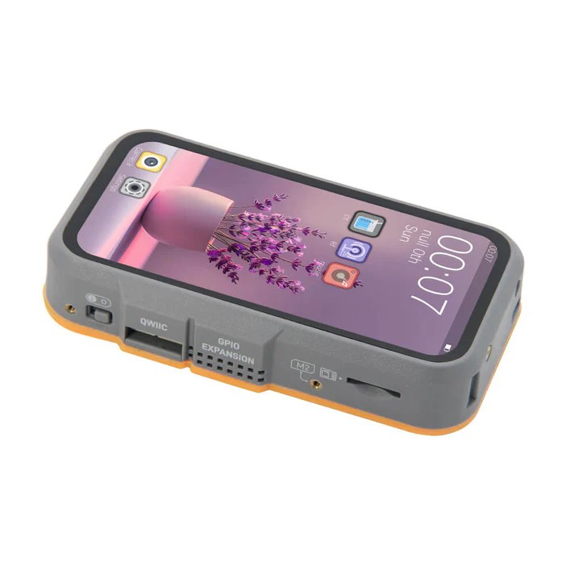
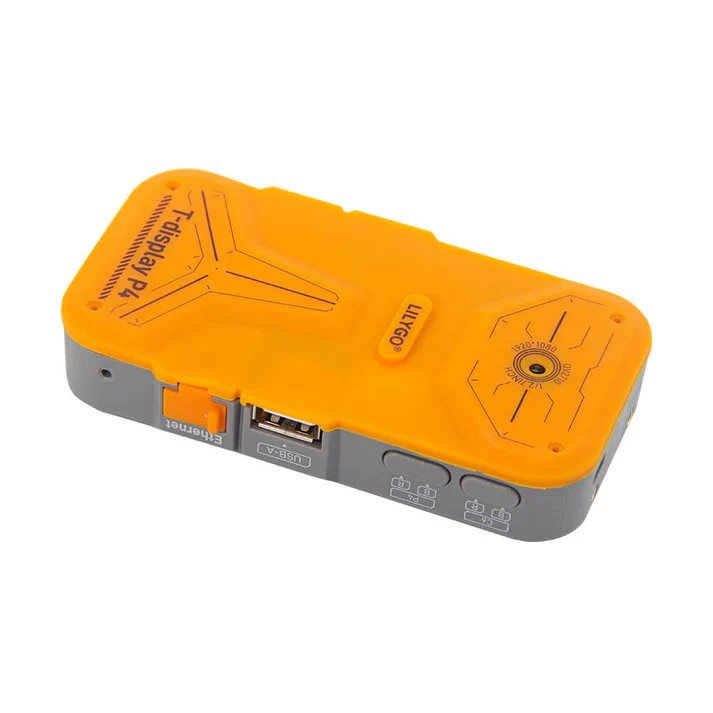
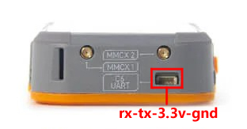

<h1 align="center">T-Display-P4</h1>

## [英语](./README.md) | **中文**

[](./LICENSE)
[](https://github.com/espressif/esp-idf)
[](https://isocpp.org/)

<p align="center">
  
</p>

## 概述

T-Display-P4 是一款以 **ESP32-P4** 为主控的高性能开发平台。产品搭载高分辨率 MIPI-DSI 触摸屏和 **ESP32-C6** 无线协处理器，并集成音频、LoRa、GPS、以太网、惯性传感器、电池监测、SD 卡存储和 MIPI-CSI 摄像头等功能。

产品支持两种屏幕组件：4.05 英寸 540 x 1168 TFT 屏，以及 4.1 英寸 568 x 1232 AMOLED 屏。可选的 T-Display-P4-Keyboard 扩展板提供键盘、背光控制和 T-MixRF 射频/NFC 接口。

## 目录

- [概述](#概述)
- [设备版本](#设备版本)
- [预览](#预览)
- [支持框架](#支持框架)
- [快速开始](#快速开始)
- [硬件模块](#硬件模块)
- [引脚总览](#引脚总览)
- [项目资料](#项目资料)
- [常见问题](#常见问题)

## 设备版本

| 版本 | 日期 | 说明 |
| :---: | :---: | --- |
| T-Display-P4 V1.0 | 2025-06-13 | 初始设备版本 |
| T-Display-P4-Keyboard V1.0 | 2025-09-12 | 初始键盘扩展板版本 |
| T-Display-P4 V2.0 Evaluation Preview | 2026-05-22 | 评估预览版硬件资料 |

## 预览

<p align="center">
  
  
  
  
</p>

## 支持框架

| 框架 | 状态 | 版本 |
| --- | --- | --- |
| ESP-IDF | 推荐 | `>= v5.5.4` |

## 快速开始

### 使用 ESP-IDF 构建

请先安装 ESP-IDF。环境安装与配置请参考官方文档：
[ESP-IDF 入门指南](https://docs.espressif.com/projects/esp-idf/zh_CN/latest/esp32p4/get-started/index.html)

克隆仓库时请同时拉取子模块：

```bash
git clone --recursive https://github.com/Xinyuan-LilyGO/T-Display-P4.git
```

如果克隆时没有使用 `--recursive`，请手动初始化子模块：

```bash
git submodule update --init --recursive
```

在 `menuconfig` 中选择示例，然后构建并烧录工程：

```bash
idf.py set-target esp32p4
idf.py menuconfig
idf.py build
idf.py flash monitor
```

```text
Example Configuration
`-- Select the example to build
```

### 示例

| 示例链接 | 说明 |
| --- | --- |
| [`lilygobox-espidf`](https://github.com/Xinyuan-LilyGO/lilygobox-espidf) | T-Display-P4 出厂应用示例 |
| [`lilygo_device_driver_example`](https://github.com/Xinyuan-LilyGO/lilygo_device_driver_example) | 在独立应用工程中集中维护的通用示例 |
| [`main/examples`](./main/examples) | T-Display-P4 板级专用示例 |
| [`main/keyboard_examples`](./main/keyboard_examples) | 键盘扩展板专用示例 |

请通过上方入口查看最新源码和当前支持的示例。

### 预编译固件

以下是已经编译好的固件。

烧录预编译固件时，可参考乐鑫官方 [ESP 固件在线烧录平台说明](https://docs.espressif.com/projects/esp-techpedia/zh_CN/latest/esp-friends/get-started/try-firmware/try-firmware-platform.html)。

| 固件 | 烧录地址 | 说明 |
| --- | --- | --- |
| [`LilygoBox`](https://github.com/Xinyuan-LilyGO/lilygobox-espidf/releases/latest) | `0x0 (merged)` | T-Display-P4 最新出厂固件 |
| [`[T-Display-P4][coprocessor_download_mode]`](<./firmware/[T-Display-P4][coprocessor_download_mode]>) | `0x0` | 主设备协处理器下载模式准备固件 |
| [`[T-Display-P4][edge_agent]`](<./firmware/[T-Display-P4][edge_agent]>) | `0x0` | Edge Agent 应用固件 |
| [`[T-Display-P4][xiaozhi]`](<./firmware/[T-Display-P4][xiaozhi]>) | `0x0` | 小智应用固件 |

> [!IMPORTANT]
> 烧录 T-Display-P4 主设备固件时选择 `ESP32-P4`；烧录协处理器网络适配器固件时，应按照实际板载协处理器选择芯片型号，T-Display-P4 V1.0 选择 `ESP32-C6`。固件不能跨芯片混用。

#### 烧录协处理器网络适配器固件

为兼容后续可能采用不同协处理器的硬件版本，本节统一使用“协处理器”名称，不将操作流程绑定到某一芯片型号。T-Display-P4 V1.0 使用的协处理器为 ESP32-C6。

烧录协处理器前，必须先为 T-Display-P4 主设备烧录并运行协处理器下载模式准备程序：

1. 准备程序源码：[`coprocessor_download_mode`](https://github.com/Xinyuan-LilyGO/lilygo_device_driver_example/tree/main/main/examples/coprocessor_download_mode)。
2. 也可以直接使用本仓库提供的预编译固件：[`firmware/[T-Display-P4][coprocessor_download_mode]`](<./firmware/[T-Display-P4][coprocessor_download_mode]>)。
3. 将准备程序烧录到 T-Display-P4 主设备，正常启动主设备并查看其串口日志。

> [!IMPORTANT]
> 必须确认主设备已经正常运行，并且串口日志输出 `Coprocessor preparation completed` 后，才能继续烧录协处理器。未看到该日志时，请勿进行协处理器下载。

协处理器需要通过机身上的独立串口接口烧录。接口位置和引脚顺序如下图所示：

<p align="center">
  
</p>

请使用 **3.3 V 逻辑电平**的 USB 转串口工具，并交叉连接收发信号：

| T-Display-P4 协处理器接口 | USB 转串口工具 |
| --- | --- |
| `RX` | `TX` |
| `TX` | `RX` |
| `GND` | `GND` |
| `3.3V` | 仅在串口工具需要电平参考时连接 `3.3V` |

> [!WARNING]
> 严禁将 `5V` 串口电平或 `5V` 电源接入 `3.3V` 引脚。建议正常给 T-Display-P4 供电，USB 转串口工具只连接 `RX`、`TX` 和 `GND`；只有确认工具需要外部电平参考时才连接 `3.3V`。

烧录步骤：

1. 从 [`LilygoBox` 最新版本](https://github.com/Xinyuan-LilyGO/lilygobox-espidf/releases/latest)下载与板载协处理器相匹配的 network-adapter 固件。
2. 关闭设备电源，并按照上表连接 USB 转串口工具。
3. 正常给 T-Display-P4 供电，再次确认主设备正常运行且串口日志已输出 `Coprocessor preparation completed`。
4. **让协处理器进入下载模式：**按住协处理器的 `BOOT` 按键，短按一次协处理器的 `RESET` 按键，然后松开 `BOOT` 按键。
5. 打开乐鑫 ESP 固件在线烧录平台，按照实际板载协处理器选择芯片型号（T-Display-P4 V1.0 选择 `ESP32-C6`），串口选择 USB 转串口工具对应的端口。
6. 选择 network-adapter `.bin` 文件，烧录地址填写 `0x0`，然后开始烧录。
7. 烧录完成后，为 T-Display-P4 主设备重新烧录所需的应用固件，并将整机重新上电。

如果烧录工具无法连接，请先确认主设备准备程序已输出 `Coprocessor preparation completed`，然后重新执行第 4 步，并确认 `RX/TX` 已交叉连接、串口使用 3.3 V 逻辑电平且没有其他程序占用该串口。

## 硬件模块

### T-Display-P4 V1.0

| 功能 | 器件 | 接口 |
| --- | --- | --- |
| 主控 MCU | ESP32-P4，16 MB Flash | — |
| 无线协处理器 | ESP32-C6-MINI-1U / ESP32-C6-FH4，4 MB Flash | SDIO |
| TFT 屏幕与触摸 | H0405S002T002-V0 / HI8561，4.05 英寸，540 x 1168 | MIPI-DSI / I2C |
| AMOLED 屏幕与触摸 | H0410S001AMT001-V0 / RM69A10 / GT9895，4.1 英寸，568 x 1232 | MIPI-DSI / I2C |
| 音频 | ES8311 / NS4150B / 驻极体电容麦克风 | I2S |
| LoRa | SX1262 / LR2021 | SPI |
| GPS | L76K | UART |
| RTC | PCF8563 | I2C |
| 惯性传感器 | ICM20948 | I2C |
| 振动 | AW86224AFCR | I2C |
| 充电 | LGS4056H，支持电池 NTC | — |
| 电量计 | BQ27220 | I2C |
| 摄像头 | OV2710 | MIPI-CSI |
| SD 卡 | SD 卡槽 | SDMMC / SPI |
| 以太网 | IP101GRI | RMII |
| IO 扩展 | XL9535 | I2C |

- 相关资料：
  - [Espressif 技术文档](https://www.espressif.com/zh-hans/support/documents/technical-documents)
  - [ESP32-C6-MINI-1/MINI-1U 数据手册](https://www.espressif.com/sites/default/files/documentation/esp32-c6-mini-1_mini-1u_datasheet_cn.pdf)
  - [HI8561](<./docs/HI8561_Preliminary _DS_V0.00_20230511.pdf>)
  - [RM69A10](<./docs/RM69A10_DataSheet_V0.2_20230330%C2%A0(Public%C2%A0version).pdf>)
  - [GT9895](./docs/GT9895_Datasheet_V1.1.pdf)
  - [ES8311](./docs/ES8311.pdf)
  - [NS4150B](./docs/NS4150B.pdf)
  - [SX1262](./docs/DS_SX1261-2_V2_1.pdf)
  - [LR2021](<./参考资料/semtech_cpp_bus_driver/LR2021_22_12_Datasheet_v2.1.pdf>)
  - [L76K](./docs/L76KB-A58.pdf)
  - [PCF8563](./docs/PCF8563.pdf)
  - [ICM20948](./docs/ICM20948.pdf)
  - [AW86224AFCR](./docs/AW86224AFCR.pdf)
  - [LGS4056H](./docs/LGS4056H.pdf)
  - [BQ27220](./docs/bq27220_en.pdf)
  - [OV2710](<./docs/OV2710_CSP3_DS_2.0_KING HORN ENTERPRISES Ltd..pdf>)
  - [IP101GRI](./docs/IP101GRI.pdf)
  - [XL9535](./docs/XL95x5.pdf)

### T-Display-P4-Keyboard V1.0

| 功能 | 器件 | 接口 |
| --- | --- | --- |
| 键盘控制器 | TCA8418 | I2C |
| 键盘背光 | SY7200A | PWM |
| IO 扩展 | XL9555 | I2C |
| Sub-GHz 射频 | T-MixRF 上的 CC1101 | SPI |
| 2.4 GHz 射频 | T-MixRF 上的 NRF24L01 | SPI |
| NFC | T-MixRF 上的 ST25R3916 | SPI |

- 相关资料：
  - [TCA8418](./docs/tca8418.pdf)
  - [SY7200A](./docs/SY7200AABC.pdf)
  - [XL9555](./docs/XL95x5.pdf)
  - [CC1101](./docs/cc1101.pdf)
  - [NRF24L01](./docs/NRF24L01P-R.pdf)
  - [ST25R3916](./docs/st25r3916.pdf)

## 引脚总览

板级引脚定义位于设备驱动配置文件中：

- [`t_display_p4_config.h`](./libraries/lilygo_device_driver/src/device/t_display_p4/t_display_p4_config.h)
- [`t_display_p4_keyboard_config.h`](./libraries/lilygo_device_driver/src/device/t_display_p4/t_display_p4_keyboard_config.h)

## 项目资料

| 文档 | 说明 |
| --- | --- |
| [`T-Display-P4 V1.0 TFT`](<./project/T-Display-P4_V1.0(H0405S002T002-V0)_202601061148.pdf>) | 4.05 英寸 TFT 组件的 V1.0 硬件项目 PDF |
| [`T-Display-P4 V1.0 AMOLED`](<./project/T-Display-P4_V1.0(H0410S001AMT001-V0)_202601061148.pdf>) | 4.1 英寸 AMOLED 组件的 V1.0 硬件项目 PDF |
| [`T-Display-P4 V2.0 Evaluation Preview`](<./project/T-Display-P4_v2.0(Evaluation Preview)_202605221021.pdf>) | V2.0 评估预览版硬件项目 PDF |
| [`docs`](./docs) | 数据手册与外设文档 |
| [`功耗测试日志`](<./relevant_test/PowerConsumptionTestLog_[T-Display-P4_V1.0]_20250605.pdf>) | T-Display-P4 V1.0 功耗测试数据 |

## 常见问题

<details>
<summary>Q. 为什么开发板一直烧录失败？</summary>

A. 开始下载时按住 `BOOT` 按键，烧录开始后再松开。

</details>

<details>
<summary>Q. 为什么缺少子模块头文件或组件？</summary>

A. 请初始化仓库的全部子模块：

```bash
git submodule update --init --recursive
```

</details>

<details>
<summary>Q. 如何切换不同的示例？</summary>

A. 执行 `idf.py menuconfig`，打开 `Example Configuration`，选择需要的示例，保存后重新构建工程。

</details>
